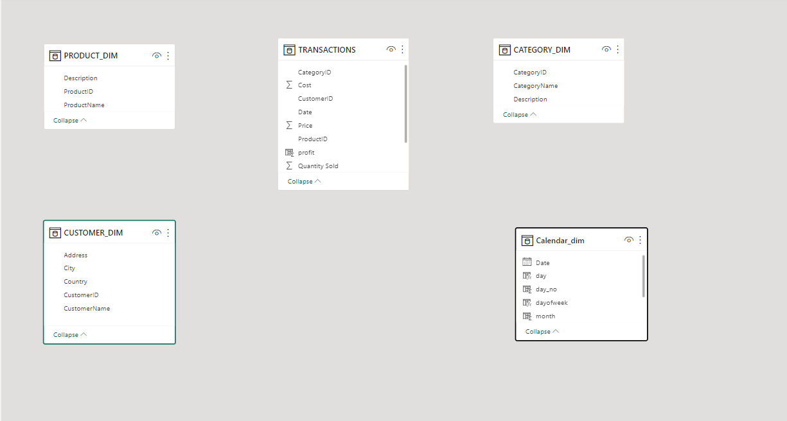
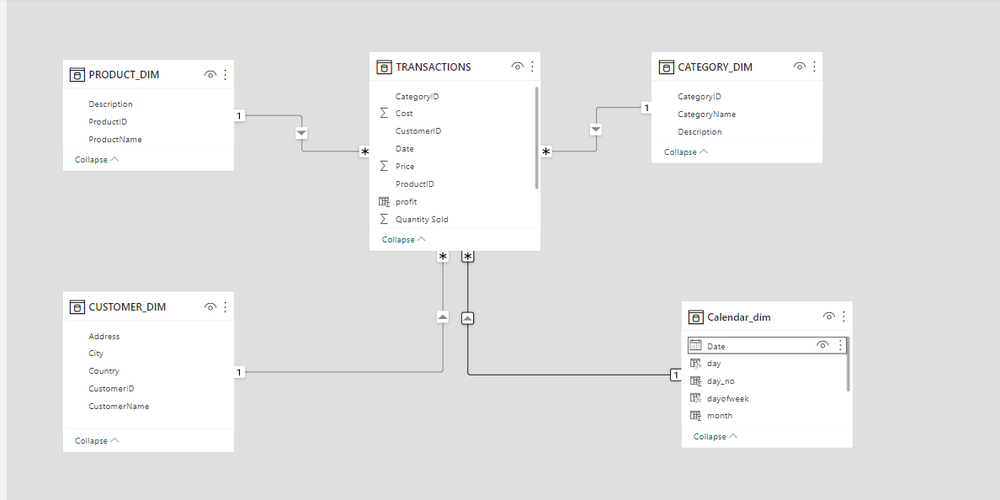
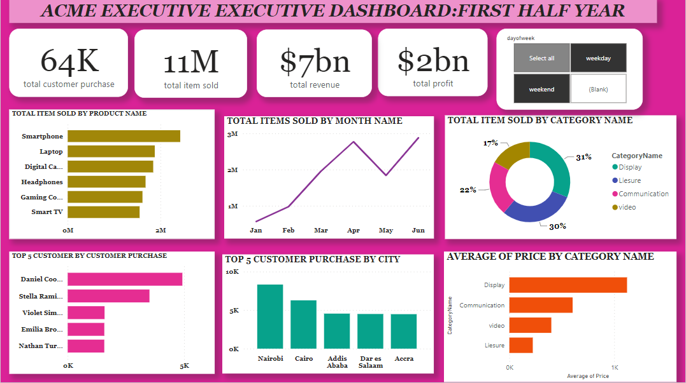

# ACME ELECTRONICS SALES PERFORMANCE DASHBOARD:FIRST HALF YEAR

 ## DISCLAIMER:
All dataset and reports do not represent any company,institution or country but just a dummy dataset to demostrate capabilities of powerbi

Acme Electronics, a leading technology distributor, is at the forefront of the ever-evolving  electronics industry. As a trusted provider of cutting-edge products, including laptops, digital  cameras, gaming consoles, smartphones, headphones, and smart TVs, Acme Electronics serves a  wide range of wholesale customers.

This project is to analyse and derive insights to answer crucial questions and help stakeholders make data driven decisions.This ia a power bi anlysis of an imaginary enterprise.

 ## PROBLEM STATEMENT
Build a robust data model that reduces redundancy, optimizes report speed and performance, and enables efficient analysis of sales data for the aforementioned product categories. 
## SKILLS AND CONCEPTS DEMOSTRATED
- Primary keys and Foreign Keys 
- Power query
- ETL
- Normalization and Analysis 
- Modelling
- slicers
- Data analysis and Data visualisation

## MODELLING
  Automatically derived relationship are adjusted to remove and replace unwanted relationship with the required
  
  The model is a star schema
  
  There are five dimension tables and 1 fact table.The dimension tables are all joined to the fact table in the auto model table with a one to many relationship
  
 Adjusted model  
 Auto model
__________________|__________________

## ANALYSIS
  The report consists of:
- Total customer purchase
- total item sold
- Total revenue
- Total profit and much more

  ## VISUAUALISATION

  

  
  - Total customer purchase is 64k
  - Total item sold is 11m
  - Total revenue is $7bn
  - total profit is $2bn
  - top item sold is smart phone
  - total item by category name is display
  - top customer by profit is daniel cooper
  - top customer purchase by city is nairobi

    
  
  
  
